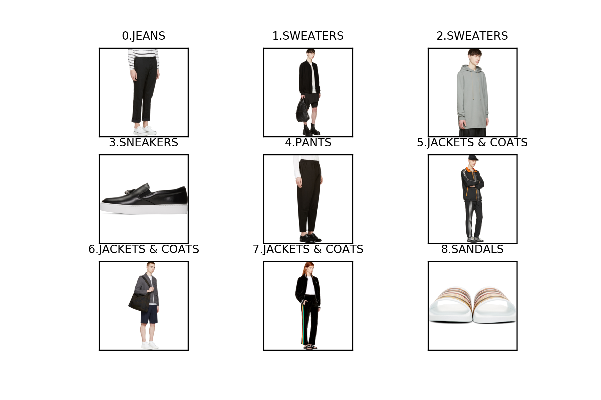

# FashionGen Dataset

- 官网： [https://www.fashion-gen.com/](https://www.fashion-gen.com/)
- Paper: [Fashion-Gen: The Generative Fashion Dataset and Challenge](https://arxiv.org/pdf/1806.08317.pdf)
- 相关代码： [FashionGenAttnGAN](https://github.com/menardai/FashionGenAttnGAN)

**下载后的数据集包含两个文件：**  

- fashiongen_256_256_train.h5 (13.3G)
- fashiongen_256_256_validation.h5 (1.66G)

**每一个H5文件中的关键字：**

- index, 
- index_2, 
- input_brand 品牌， 
- input_category 服装类别， 
- input_composition， 服装成分,  
- input_concat_description 一长串的描述，几句话   
- input_department 哪一部分，是‘CLOTHING’还是 ‘ACCESSORIES’、‘BAGS’等  
- input_description 相对input_concat_description较简洁有效的描述  
- input_gender 性别  
- input_image 图像， (260490, 256, 256, 3)， 0-255   
- input_msrpUSD What is it?*  
- input_name 带颜色和款式的name  
- input_pose 字符串，不是关键点，标记姿态，每张图片有四个姿态  
- input_productID   
- input_season  
- input_subcategory 款式

注意： 所有字符串都是带编码格式的，使用 .decode('utf-8', errors='ignore') 转回不带格式的字符串

**训练数据集中一共48个类，总 260,490 张图片，每个类的标签及对应图片总数如下：**

|      Category      |  Num  |          Category          |  Num  |
| :----------------: | :---: | :------------------------: | :---: |
|       SHIRTS       | 11398 |   UNDERWEAR & LOUNGEWEAR   |  23   |
|      SWEATERS      | 44591 |         KEYCHAINS          |  202  |
|       JEANS        | 13586 |         TOTE BAGS          | 2281  |
|       PANTS        | 23230 |   BOAT SHOES & MOCCASINS   |  12   |
|        TOPS        | 47764 | POUCHES & DOCUMENT HOLDERS |  121  |
|  SUITS & BLAZERS   | 2845  |          SNEAKERS          | 10478 |
|       SHORTS       | 7416  |  DUFFLE & TOP HANDLE BAGS  | 1533  |
|  JACKETS & COATS   | 35035 |          EYEWEAR           | 2494  |
|        TIES        |  253  |           BOOTS            | 4515  |
|        HATS        | 4545  |           FLATS            | 3855  |
|       SKIRTS       | 6909  |          LACE UPS          |  631  |
|     JUMPSUITS      |  610  |         MONKSTRAPS         |  29   |
|      SWIMWEAR      |  201  |          LOAFERS           |  481  |
|      DRESSES       | 9458  |           SOCKS            |  250  |
| BELTS & SUSPENDERS |  335  | POCKET SQUARES & TIE BARS  |  23   |
|      LINGERIE      | 1314  |          SANDALS           | 3515  |
|      SCARVES       | 1138  |           HEELS            | 1931  |
|       GLOVES       |  66   | MESSENGER BAGS & SATCHELS  |  530  |
|    FINE JEWELRY    |  475  |        ESPADRILLES         |  119  |
| CLUTCHES & POUCHES | 1120  |        DUFFLE BAGS         |  120  |
|      BLANKETS      |  17   |      BAG ACCESSORIES       |  110  |
|      JEWELRY       | 4933  |        TRAVEL BAGS         |  29   |
|     BACKPACKS      | 2858  |       MESSENGER BAGS       |  88   |
|   SHOULDER BAGS    | 6952  |         BRIEFCASES         |  71   |

**测试一共45个类，总 32,528 张图片，每个类的标签及对应图片总数如下：**

|      Category      | Num  |          Category          | Num  |
| :----------------: | :--: | :------------------------: | :--: |
|  JACKETS & COATS   | 4357 |           BOOTS            | 570  |
|       JEANS        | 1694 |          JEWELRY           | 603  |
|       PANTS        | 2910 |          SNEAKERS          | 1306 |
|       SHIRTS       | 1418 |          SANDALS           | 443  |
|      DRESSES       | 1184 |         BRIEFCASES         |  11  |
|  SUITS & BLAZERS   | 355  |           SOCKS            |  33  |
|      SWEATERS      | 5602 |         TOTE BAGS          | 279  |
|       SHORTS       | 925  |          LOAFERS           |  60  |
|        TIES        |  30  | MESSENGER BAGS & SATCHELS  |  65  |
|        TOPS        | 5944 |           HEELS            | 238  |
|        HATS        | 571  |  DUFFLE & TOP HANDLE BAGS  | 192  |
|       SKIRTS       | 872  |         KEYCHAINS          |  24  |
|     JUMPSUITS      |  78  |       MESSENGER BAGS       |  12  |
|      SWIMWEAR      |  26  |          LACE UPS          |  78  |
|      SCARVES       | 151  |          BLANKETS          |  2   |
|      LINGERIE      | 161  | POUCHES & DOCUMENT HOLDERS |  15  |
| BELTS & SUSPENDERS |  45  | POCKET SQUARES & TIE BARS  |  2   |
| CLUTCHES & POUCHES | 152  |          EYEWEAR           | 314  |
|   SHOULDER BAGS    | 867  |           GLOVES           |  8   |
|    FINE JEWELRY    |  57  |      BAG ACCESSORIES       |  14  |
|     BACKPACKS      | 349  |        ESPADRILLES         |  18  |
|       FLATS        | 476  |   UNDERWEAR & LOUNGEWEAR   |  5   |
|    DUFFLE BAGS     |  12  |                            |      |

图片以及 Caption 样例：

对应的 Caption分别为： 

-  **0-152775-JEANS**: Straight-leg Japanese denim jeans in black. Four-pocket styling. Raw edge at cuffs. Zip-fly. Tonal stitching. Approx. 6.75" leg opening. 
-  **1-80627-SWEATERS**: Long sleeve jacquard knit bomber jacket in black. Rib knit stand collar, cuffs, and hem. Concealed zip closure with press-stud placket at front. Welt pockets at waist. Raglan sleeves. Asymmetric hem. Unlined. Tonal stitching.
-  **2-82295-SWEATERS**: Long sleeve hoodie in 'hustler' grey. Beige drawstring at hood. Ribbed sleeve cuffs. Fleece lining. Tonal stitching.
-  **3-155846-SNEAKERS**: Buffed leather slip-on sneakers in black. Round toe. Signature safety pin hardware at vamp. Elasticized gusset at sides of tongue. Padded collar. Treaded rubber sole in white featuring rubberized logo at heel. Silver-tone hardware. Tonal stitching.
-  **4-12381-PANTS**: Cropped relaxed-fit sarouel pants in black. Four-pocket styling. Elasticized waistband with tonal drawstring. Pleat feature at kneecaps. Tonal stitching.
-  **5-157450-JACKETS & COATS:** Long sleeve technical satin jacket in black. Trim in orange throughout. Stand collar. Two-way zip closure at front. Logo printed in silver-tone at chest and upper sleeve. Zippered pockets at waist. Signature stripes in metallic silver-tone at body and sleeve. Raglan sleeves. Elasticized cuffs and hem. Unlined. Tonal stitching.
-  **6-80746-JACKETS & COATS**: Long sleeve woven jacket in charcoal grey. Peaked lapel collar. Zip closure in white at front. Flap pockets at body. Raglan sleeves. Central vent at back hem. Tonal stitching.
-  **7-193990-JACKETS & COATS:** Long sleeve velvet bomber jacket in black. Rib knit stand collar, cuffs, and hem striped in black and metallic silver-tone. Zip closure at front. Logo appliqu at bust. Welt pockets at waist. Zippered vents at cuffs. Fully lined. Silver-tone hardware. Tonal stitching.
-  **8-228736-SANDALS**: Rubber slip-on sandals in white. Open round toe. Signature multicolor stripes printed at vamp. Moulded footbed. Tonal rubber sole. Tonal stitching.

（第二个 id 为图像在数据集中的索引，均来自于训练集）